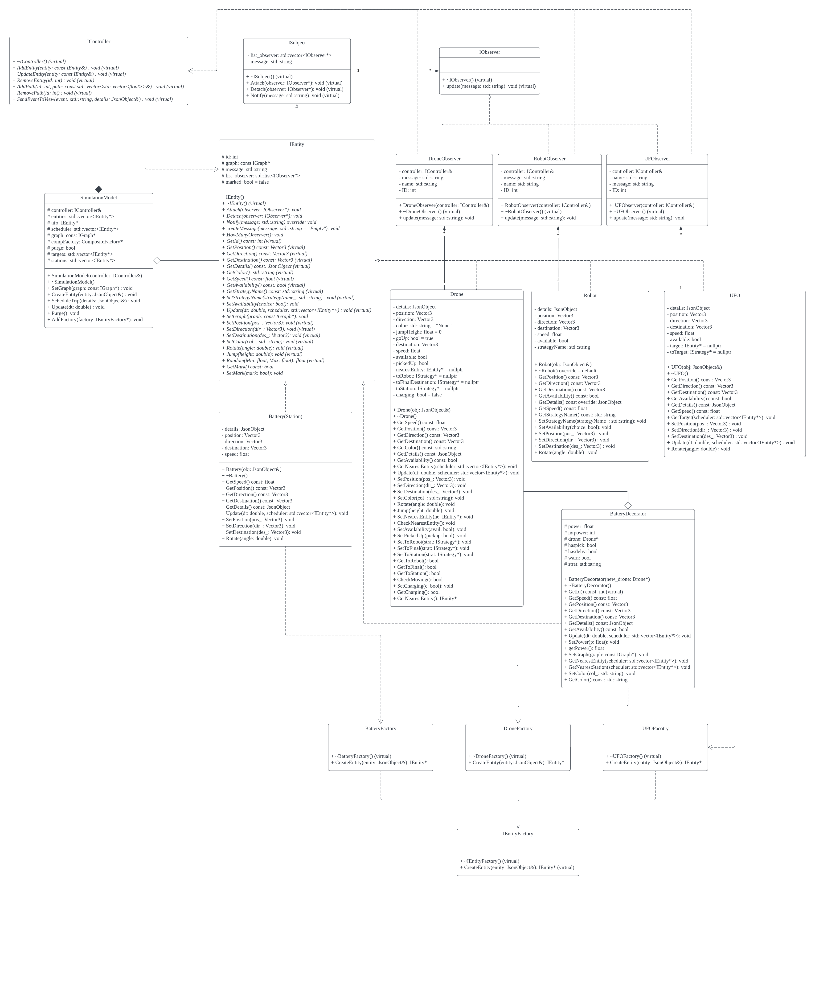

# Drone Simulation System

## What is the project about?

This project is a drone simulation system that consists of a 3D UMN map page and a trip schedule page. Users can schedule their trips on the schedule page, and the drone will pick them up and send them to their destination.

The system is implemented in C++ and incorporates HTML, CSS, and JavaScript. We cover a range of topics discussed in class, including design patterns, Git, code documentation, code style, and agile development.

## How to run the simulation?

Here is a quick overview of how to run the visualization (If you are using ssh, navigate to ssh category below):

    # Go to the project directory
    cd /path/to/repo/project
    
    # Build the project
    make -j
    
    # Run the project (./build/web-app <port> <web folder>)
    ./build/bin/transit_service 1942 apps/transit_service/web/
    
Navigate to http://127.0.0.1:1942, and you should see a visualization.

Navigate to http://127.0.0.1:1942/schedule.html, and you should see a page to schedule the trips.

(05/02 Update: 8081->1942 To avoid collide with other group)

*Note: 1942 will depends on what port you used. If you use port 8082, then it will be http://127.0.0.1:8082 instead.*

### Simulation

#### Schedule
You will be able to schedule the robots for a ride in this page http://127.0.0.1:1942/schedule.html. 

Type passenger name, select start and end destination, and press `Schedule Trip` button to schedule a trip. 

Now go to 3D Visualization page and select the view of the entities on top right corner.

#### 3D Visualization
You will be able to watch the simulation of the drone and the passenger here http://127.0.0.1:1942.

On top right corner, you can change your camera view into locking the entities.

## What does the simulation do specifically?

The simulation starts in a mission-less state, where a standby drone spawns on the map. On the schedule page, you can select a starting point, a destination, and a preferred navigation strategy. When a trip is scheduled, a robot representing the user appears on the map. The drone then flies to pick up the user and transports them to the destination using the selected strategy. In case of multiple scheduled trips, the drone prioritizes the closest user. Drones have limited power and constantly monitor their power level. They autonomously navigate to the nearest charging station on the map to recharge at the appropriate time. Detailed information about the drone's power level and scheduled trips is displayed on the notification bar within the map page. Additionally, the system includes a Purge function that, when triggered, creates a UFO that engulfs and removes all entities present on the map.

## New Feature Contribution Table

|  Feature Name   | Task Contributor(s)         |
|:---------------:|-----------------------------|
| Drone's Battery | Yicheng Zhai                |
|       UFO       | Junyuan Wang                |
|  Notification   | Jiatan Huang & Ziyue Zhuang |

### What does it do?

1. Drone Battery System:
A battery has been added to the drone. Now, the drone's flight will consume power. The color of the drone will change based on the battery level. When the battery reaches 0%, the drone will stop working. If the drone's power is less than 30%, it will fly to the nearest charging station on the map to recharge. There are a total of 5 charging stations set up on the map.

2. Notification:
The Schedule page will now display more real-time data using Observer. This includes the battery level of the drone, the status and details of each trip, and the UFO action in the UFO feature.

3. (Extra) UFO:
A UFO, created by UFOFactory, is used to eliminate all entities on the map. The UFO has a high speed and can fly to every entity on the map to "eat" them.

### Why is it significantly interesting?

1. Drone Battery System:
Drones now need to monitor their battery levels while planning trips. They must find the right time to recharge amidst multiple flights. This feature enhances the system's practicality as no drone currently possesses unlimited energy.

2. Notification:
In a 3D map, it becomes challenging to simultaneously observe the status of each entity. Since all robot models look alike, it becomes difficult to differentiate between those that have reached their destinations and those still awaiting their turn. The information in the Notification bar can assist us in comprehending which tasks the drones are performing and which ones have been completed. Moreover, it provides a more intuitive display of the drone's strategy plans.

3. UFO:
This is an extra feature to eat all entities on the map, which is also a warning from aliens to humans! :p Just kidding. 

### How is it added to the existing work?

1. Drone Battery System:  
A BatteryDecorator is created and wrapped around the Drone when it is created in the DroneFactory. This Decorator records the drone's power and changes the drone's strategy according to the battery level. We also created the BatteryFactory to spawn Charging Stations in the SimulationModel.

2. Notification:  
We defined ISubjects to add, remove, and notify observers that extend IEntity. IObserver is also defined to create a list of observers, and implement concrete classes that adhere to the observer interface (e.g., DroneObserver and RobotObserver). Now, whenever an important event occurs to the publisher (when the state is updated), it iterates through all registered observers and calls the update method to track changes in the publisher's state. To send data to the frontend, we set the observer class reference to IController controller and have an IController& as a member variable in the observer class.

3. UFO:  
UFO inherits IEntity and is capable of marking all other entities in the SimulationModel. When the model iterates through the list of entities and identifies those that are marked, these entities will be removed from the map!

### Which design pattern did you choose to implement it and why?

1. Drone Battery System:  
- Decorator pattern: The BatteryDecorator enables the dynamic addition of new behaviors to the drone. We can modify the drone's behavior without altering its underlying implementation. Additionally, this decorator can be reused for future entities.
- Factory pattern: By utilizing a factory, we can abstract the details of creating multiple charging stations.

2. Notification:  
- Observer pattern: Observers can be added and removed independently, without requiring knowledge of the specific implementation being observed. Therefore, adding new observers is straightforward. This enhances the system's flexibility and facilitates easy testing.

3. UFO:  
- Factory Pattern: The UFOFactory class implements the Factory Method pattern, similar to DroneFactory and RobotFactory.
- Observer Pattern: The UFObserver class also implements the Observer pattern, akin to DroneObserver and RobotObserver. 

### Instruction to use this new feature

1. Drone Battery System:
Enable drone movement by scheduling trips. You can monitor battery status changes in the notification bar. The drone will turn yellow at 60% battery and red at 30% battery. When the drone's power drops below 30%, it will automatically fly to the nearest charging station for recharging. The charging process can be viewed in the Notification bar.

2.Notification:
The notification feature will appear in the shaded area on the left side of the screen, within the notification bar. It provides real-time updates on the status of the drone and UFO while they are operational.

3. UFO:  
By clicking the "The Purge" button on the panel page, the UFO will be added to the map. It automatically devours all entities present on the map, including newly added entities.

## Sprint retrospective

We apply the agile development approach to project management. We created multiple "sprint" iteration cycles using Scrum. First we created the tasks that we planned to complete in the "delegate list". We divided the tasks into four phases, and at the end of each phase we had a meeting to discuss progress and adjust the schedule.
This approach encouraged our team to communicate and share information in a timely manner and facilitated teamwork. Applying agile methods has increased our efficiency in completing projects and ensuring we deliver high quality code. We also encountered some obstacles in the process. It took us longer than expected to create the "Notifications" feature, but we adjusted our timeline in time to meet our goals.

## UML diagram

## Docker Link
https://hub.docker.com/r/junyuanwang/drone_sim

## Video Presentation Link
https://youtu.be/e3I0-oaKZxM

#### What is in this directory?
- `app` folder, which contains:
  - `graph_viewer`: producing graph visualization
  - `transit_service`: visualization
- `libs` folder, which contains:
  - `routing`: finding the paths
  - `transit`: entities properties
- `README.md`: README for our group with new features
- `README_Project.md`: README for the project
- `Dockerfile`: Dockerfile to deploy the project via Docker.
- `Makefile`
- `.gitignore`
- `dependencies`
- `docs`: Doxygen files
- `images`: UML and Sprint images

